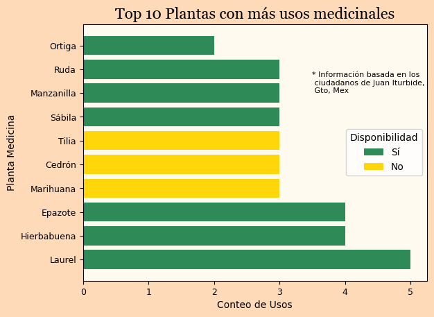

# Proyecto: Plantas medicinales en Juan Iturbide, Guanajuato 🌱🌱🌱

Este proyecto analiza un dataset recopilado en Juan Iturbide, Guanajuato, sobre plantas medicinales y sus usos. A partir de la información obtenida, se generaron visualizaciones que permiten entender mejor la diversidad, preparación y aplicaciones de estas plantas en la vida cotidiana.

## Visualizaciones

Algunos ejemplos de los gráficos generados:

.png)

Relación: Parte utilizada vs Modo de preparación

WordCloud de popularidad

etc....

(El repositorio incluye un total de 7 gráficos con distintos enfoques del análisis.)

### 🔎 Conclusiones

* La mayoría de las plantas en la lista pertenecen a la familia Lamiaceae.
* Solo el 54% de las plantas están disponibles en el mercado local.
* El laurel, la hierbabuena y el epazote son las más versátiles en cuanto a usos medicinales.
* Resulta llamativo que plantas reconocidas como el romero no aparezcan en el Top 10 de este levantamiento.
* Los tres usos medicinales más comunes son:
  - Dolor de estómago
  - Malestares respiratorios
  - Malestares gastrointestinales
* Se identificaron más de 12 métodos de preparación, que utilizan distintas partes de la planta.
* El método más común es la infusión de hojas, presente en 16 de los 49 remedios registrados.
* La nube de palabras muestra la popularidad relativa de las plantas, aunque este nivel fue interpretativo y requeriría encuestas para confirmarse.

### 💡 Aplicaciones

Aunque este dataset no represente la totalidad de las plantas medicinales de México, los hallazgos pueden tener diversos usos:

* Culturales → Difundir conocimiento sobre las plantas con menor popularidad.
* Venta directa → Mejorar la disponibilidad de plantas versátiles y populares en mercados locales y comercios formales.
* Venta indirecta → Integrar estas plantas como ingredientes en productos naturales.
* Uso casero → Facilitar el acceso a información confiable para quienes recurren a la herbolaria como primera opción.

## 🛠️ Tecnologías utilizadas

- Python
- Pandas
- Numpy
- Matplotlib
- WordCloud

## Proceso de Analisis de Datos:
* Comenzo desde la recopilacion de datos. a traves de la IA se pasó el data frame original disponible en la web, a un archivo CSV
* Revision del Date set y eliminación de columnas irrelevantes para el analisis
* Limpieza y normalizacipon de las columnas aunque fuesen categoricas.
* Añadir Columnas como "Popularidad"
* Proceso de visualización. (Se realizaron trnasformaciones de datos pertinentes como agrupamientos)
* Analisis e insights

### 📝 Créditos y referencia

✨ Este proyecto forma parte de mi ruta de aprendizaje en Ciencia de Datos y mi interés en herbolaria mexicana. Creo en que la tecnología puede ser un puente entre cultura, salud y ciencia.
Análisis y visualización de datos por: Cindy Yohana Gutierrez Nestor

Base de datos original:
Estudio de plantas medicinales utilizadas en San José Iturbide, Guanajuato, México. (2023). POLIBOTÁNICA, 56. https://doi.org/10.18387/polibotanica.56.14
